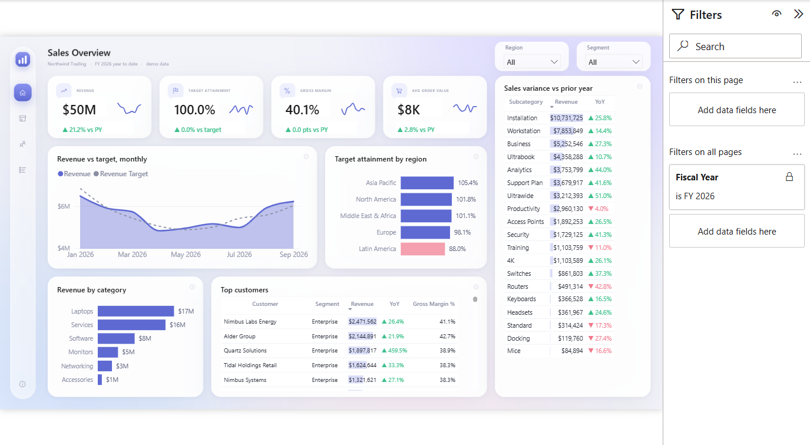

# 01 · Sales Analytics

**Question:** are we on target, and where is revenue or margin leaking? Built for a VP of Sales and regional managers.

## Pages

| Page | What it shows |
|---|---|
| Overview | Revenue, margin and target attainment with prior-year deltas and trends |
| [Products & Margin](screenshots/Products%20%26%20Margin.png) | Margin by category and product, and where discounting erodes it |
| [Customers & Reps](screenshots/Customers%20%26%20Reps.png) | Revenue by segment, industry and country, a rep leaderboard, accounts in decline |
| [Order Detail](screenshots/Order%20Detail.png) | Order-line table for drilling into the numbers |

## Model

- Star schema: `Orders` (40,789 lines) with `Customers`, `Products`, `Sales Reps`, `Regions`, `Targets` and a `Date` table; 7 relationships
- 62 DAX measures grouped as Revenue, Target, Margin, Discount, Volume and Customers, plus label and conditional-formatting measures
- Model source is TMDL in `SalesAnalytics.SemanticModel/definition`; the report is PBIR in `SalesAnalytics.Report/definition`

## Data

Synthetic and seeded, January 2024 to September 2026, in `data/`. Two patterns are planted for the dashboard to surface: a mid-2025 soft patch, and laptop discounting in Latin America eroding margin.

## Open it

1. Open `SalesAnalytics.pbip` in Power BI Desktop (PBIP support enabled).
2. In **Transform data > Edit parameters**, set `DataFolder` to the absolute path of this folder's `data/` directory.
3. Refresh.

Rebuild from scratch with the scripts in [`_scripts`](../_scripts): `generate_sales.py`, `model_sales.py`, `make_background.py`, `build_sales_pages.sh`.

Tested: built and rendered in Power BI Desktop against the CSV files here; the images above are captures of those pages. Not tested: opening from a fresh clone on another machine, or publishing to the Power BI service.
