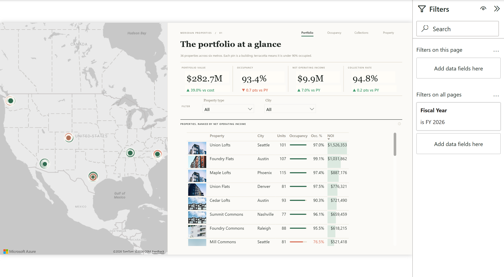

# 03 · Real Estate

**Question:** which properties underperform on occupancy, collections and NOI? Built for asset and property managers.

## Pages

| Page | What it shows |
|---|---|
| Portfolio | Portfolio KPIs and a map of the properties |
| [Occupancy & Leasing](screenshots/Occupancy%20%26%20Leasing.png) | Occupancy by property and leasing activity |
| [Collections & NOI](screenshots/Collections%20%26%20NOI.png) | Rent collection rate and net operating income |
| [Property Detail](screenshots/Property%20Detail.png) | One property at a time |

## Model

- `Rent Payments` (44,074 rows), `Leases`, `Operating Expenses` and `Maintenance Requests` as facts with `Units`, `Properties`, `Property Types` and a `Date` table; 9 relationships
- 69 DAX measures grouped as Portfolio, Occupancy, Collections, NOI and Maintenance, plus label and conditional-formatting measures
- Model source is TMDL in `RealEstate.SemanticModel/definition`; the report is PBIR in `RealEstate.Report/definition`

## Data

Synthetic and seeded, January 2024 to September 2026, in `data/`. Planted patterns: six weak properties drag occupancy, and older buildings cost more to maintain.

## Open it

1. Open `RealEstate.pbip` in Power BI Desktop (PBIP support enabled).
2. In **Transform data > Edit parameters**, set `DataFolder` to the absolute path of this folder's `data/` directory.
3. Refresh.

The map needs Azure Maps visuals enabled in your tenant.

Rebuild from scratch with the scripts in [`_scripts`](../_scripts): `generate_real_estate.py`, `model_real_estate.py`, `make_background_re.py`, `build_re.sh`.

Tested: built and rendered in Power BI Desktop against the CSV files here; the images above are captures of those pages. Not tested: opening from a fresh clone on another machine, or publishing to the Power BI service.
