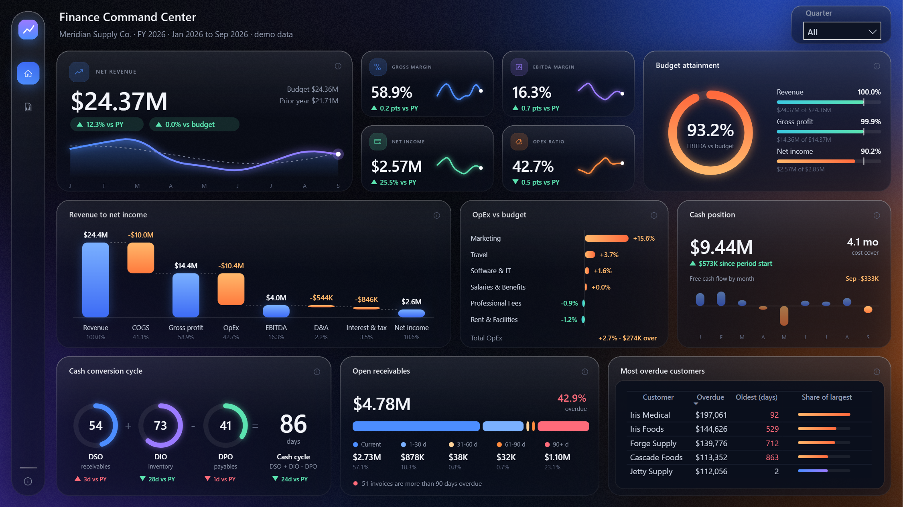

# 04 · Finance

**Question:** where are we off budget, and how healthy is cash? Built for a CFO.

## Pages

| Page | What it shows |
|---|---|
| Overview | Revenue, margins and net income vs prior year and budget, a revenue-to-net-income bridge, OpEx vs budget, cash position, cash conversion cycle and receivables ageing |
| [Income Statement](screenshots/statement.png) | P&L by line with budget and prior-year comparison |

Selecting a department cross-filters the page: [example with Marketing selected](screenshots/overview-marketing-selected.jpg).

## Model

- `GL` actuals and `Budget` by account and department, with `Receivables`, `Cash` and `Inventory`, a `PnL Lines` layout table and a `Date` table; 9 relationships
- 113 DAX measures grouped as P&L, Budget, Cash, Working capital, Prior year and Statement
- 15 of those measures generate SVG (budget ring, cash conversion cycle, receivables ageing, department bars) shown through image visuals
- The bridge and the OpEx-vs-budget chart are Deneb visuals; their Vega-Lite specs are in [`_scripts/deneb`](../_scripts/deneb)
- Model source is TMDL in `FinanceCFO.SemanticModel/definition`; the report is PBIR in `FinanceCFO.Report/definition`

## Data

Synthetic and seeded, in `data/`. Planted patterns: marketing overspend in 2026 and a large overdue receivables balance. `shipments.csv` and `warehouses.csv` are generated but not loaded by the model.

## Open it

1. Open `FinanceCFO.pbip` in Power BI Desktop (PBIP support enabled).
2. In **Transform data > Edit parameters**, set `DataFolder` to the absolute path of this folder's `data/` directory.
3. Refresh.

The report needs the [Deneb](https://deneb-viz.github.io/) custom visual.

Rebuild from scratch with the scripts in [`_scripts`](../_scripts): `generate_finance_ops.py`, `generate_finance_cash.py`, `model_finance.py`, `make_background_finance.py`, `build_finance.sh`, `add_deneb.py`.

Tested: built and rendered in Power BI Desktop against the CSV files here; the images above are captures of those pages. Not tested: opening from a fresh clone on another machine, or publishing to the Power BI service.
